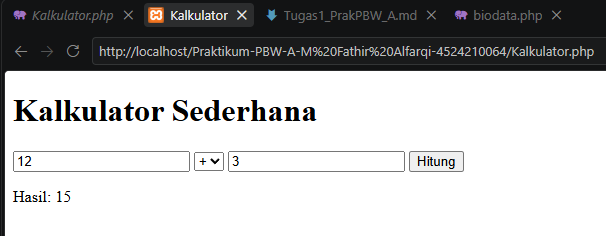
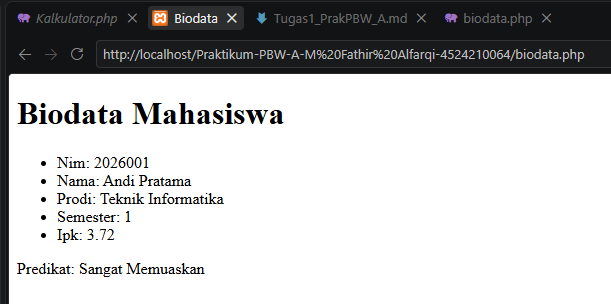
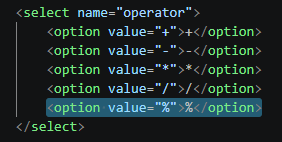
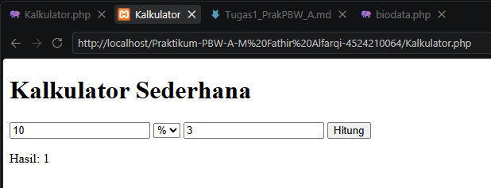
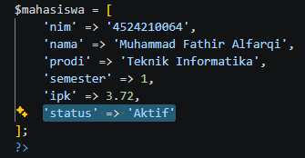
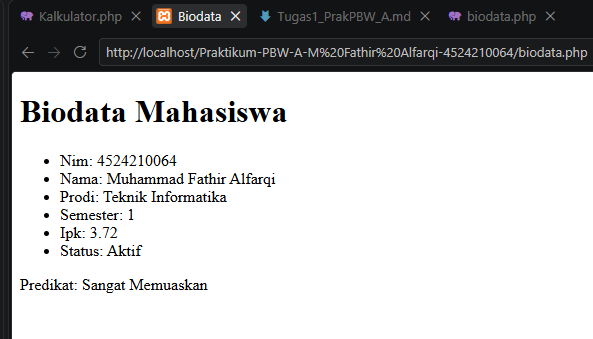
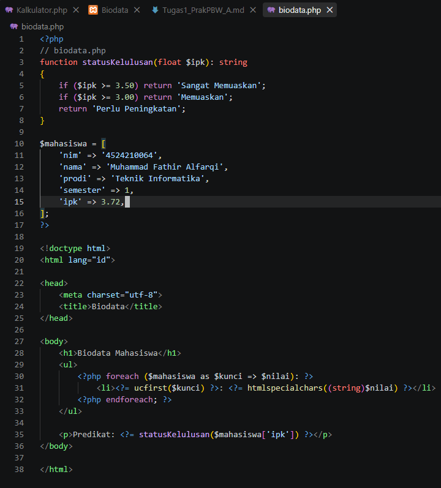
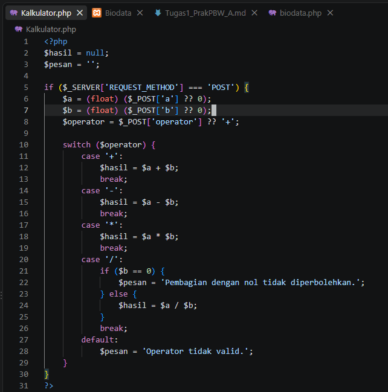
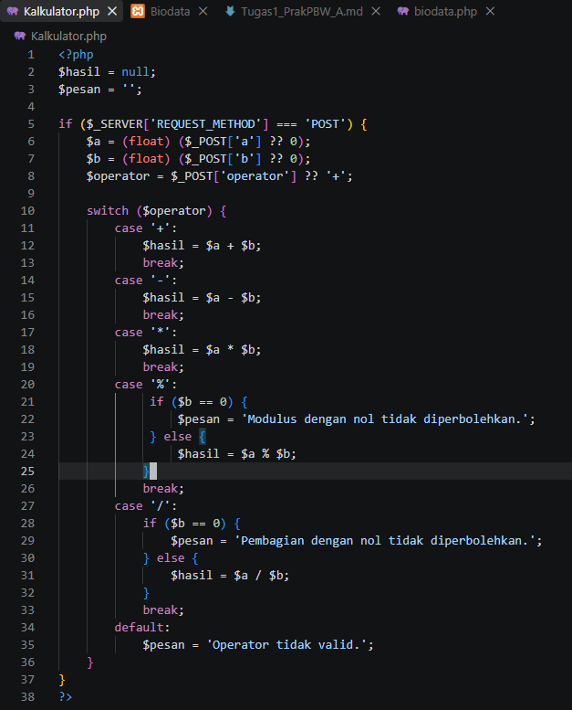
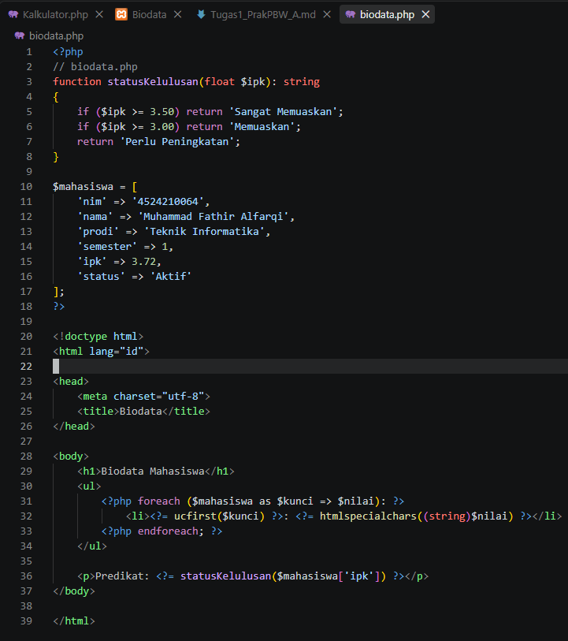

# TUGAS 1

1. Jalankan seluruh contoh Pertemuan 1 hingga menghasilkan output tanpa error kritis
2. Buat minimal dua modifikasi bermakna pada program (misalnya field baru, styling, query, atau validasi).
3. Tuliskan penjelasan singkat untuk lima bagian kode yang menurut Anda paling penting
4. Sertakan Screenshot sebelum dan sesudah di modifikasi
5. Tuliskan satu error yang pernah muncul, penyebabnya, dan Langkah perbaikannya

## JAWAB

### Contoh1 (Kalkulator.php)

```php
<?php
$hasil = null;
$pesan = '';
if ($_SERVER['REQUEST_METHOD'] === 'POST') {
    $a = (float) ($_POST['a'] ?? 0);
    $b = (float) ($_POST['b'] ?? 0);
    $operator = $_POST['operator'] ?? '+';
    switch ($operator) {
        case '+':
            $hasil = $a + $b;
            break;
        case '-':
            $hasil = $a - $b;
            break;
        case '*':
            $hasil = $a * $b;
            break;
        case '/':
            if ($b == 0) {
                $pesan = 'Pembagian dengan nol tidak diperbolehkan.';
            } else {
                $hasil = $a / $b;
            }
            break;
        default:
            $pesan = 'Operator tidak valid.';
    }
}
?>
<!doctype html>
<html lang="id">
<head>
    <meta charset="utf-8">
    <title>Kalkulator</title>
</head>
<body>
    <h1>Kalkulator Sederhana</h1>
    <form method="post" action="Kalkulator.php">
        <input type="number" step="any" name="a" required>
        <select name="operator">
            <option value="+">+</option>
            <option value="-">-</option>
            <option value="*">*</option>
            <option value="/">/</option>
        </select>
        <input type="number" step="any" name="b" required>
        <button type="submit">Hitung</button>
    </form>
    <?php if ($pesan): ?>
        <p><?= htmlspecialchars($pesan) ?></p>
    <?php elseif ($hasil !== null): ?>
        <p>Hasil: <?= htmlspecialchars((string) $hasil) ?></p>
    <?php endif; ?>
</body>
</html>
```

Output



### Contoh 2 (biodata.php)

```php
<?php
// biodata.php
function statusKelulusan(float $ipk): string
{
    if ($ipk >= 3.50) return 'Sangat Memuaskan';
    if ($ipk >= 3.00) return 'Memuaskan';
    return 'Perlu Peningkatan';
}
$mahasiswa = [
    'nim' => '2026001',
    'nama' => 'Andi Pratama',
    'prodi' => 'Teknik Informatika',
    'semester' => 1,
    'ipk' => 3.72
];
?>
<!doctype html>
<html lang="id">
<head>
    <meta charset="utf-8">
    <title>Biodata</title>
</head>
<body>
    <h1>Biodata Mahasiswa</h1>
    <ul>
        <?php foreach ($mahasiswa as $kunci => $nilai): ?>
            <li><?= ucfirst($kunci) ?>: <?= htmlspecialchars((string)$nilai) ?></li>
        <?php endforeach; ?>
    </ul>
    <p>Predikat: <?= statusKelulusan($mahasiswa['ipk']) ?></p>
</body>
</html>
```

Output



### Menambahkan  Operasi % pada Kalkulator 

Menambahkan pada switch($operator)
```php
        case '%':
             if ($b == 0) {
                 $pesan = 'Modulus dengan nol tidak diperbolehkan.';
             } else {
                 $hasil = $a % $b;
            }
            break;
```

Menambahkan pada html select name operator
```html
<option value="%">%</option>
```



Output



### Menambahkan status “Aktif” pada Biodata



Output



### 1. Pengecekan Method POST
```php
if ($_SERVER['REQUEST_METHOD'] === 'POST') {
```
**Penjelasan:** Bagian ini digunakan untuk memastikan proses kalkulator hanya dijalankan ketika form dikirim menggunakan metode POST.

### 2. Pengambilan Input Pengguna
```php
$a = (float) ($_POST['a'] ?? 0);
$b = (float) ($_POST['b'] ?? 0);
```
**Penjelasan:** Kode tersebut mengambil nilai dari input a dan b yang dikirim melalui form, kemudian mengubahnya menjadi tipe data float agar dapat digunakan dalam operasi matematika.

### 3. Percabangan switch 
```php
switch ($operator) {
    case '+':
        $hasil = $a + $b;
        break;
    case '-':
        $hasil = $a - $b;
        break;
}
```
**Penjelasan:** switch digunakan untuk menentukan operasi matematika berdasarkan operator yang dipilih oleh pengguna.

### 4. Function statusKelulusan()
```php
function statusKelulusan(float $ipk): string
{
    if ($ipk >= 3.50) return 'Sangat Memuaskan';
    if ($ipk >= 3.00) return 'Memuaskan';
    return 'Perlu Peningkatan';
}
```
**Penjelasan:** Function ini menentukan predikat mahasiswa berdasarkan nilai IPK. Penggunaan function membuat kode lebih terstruktur dan dapat digunakan kembali.

### 5. Perulangan foreach
```php
<?php foreach ($mahasiswa as $kunci => $nilai): ?>
    <li>
        <?= ucfirst($kunci) ?>:
        <?= htmlspecialchars((string)$nilai) ?>
    </li>
<?php endforeach; ?>
```
**Penjelasan:** foreach digunakan untuk membaca setiap data pada array $mahasiswa dan menampilkannya ke halaman HTML secara otomatis. Dengan cara ini, ketika field baru ditambahkan ke array, data tersebut dapat langsung ikut ditampilkan.

### Sebelum 





### Sesudah





Errornya Adalah program tidak berjalan Ketika Kode sudah benar, penyebabnya adalah file tidak masuk di xampp, perbaikannya Adalah memindahkan directory file ke xampp htdocs
